  

  
  

  <b>5th-cycle Software Design and Development student at TECSUP</b> 
  Backend • Cloud • DevOps • Cybersecurity

  

## `> [Core.Stack]`

  

  <code>Laravel</code> •
  <code>Node.js</code> •
  <code>Spring Boot</code> •
  <code>React</code> •
  <code>Android Studio</code> •
  <code>Flutter</code> •
  <code>Docker</code> •
  <code>AWS</code> •
  <code>PostgreSQL</code> •
  <code>MongoDB</code>

  

## `> [Current.Focus]`

  <code>Backend Engineering</code> •
  <code>REST APIs</code> •
  <code>Cloud Infrastructure</code> •
  <code>CI/CD</code> •
  <code>Secure Software</code>

  

## `> [Activity]`

  <picture>
    <source
      media="(prefers-color-scheme: dark)"
      srcset="https://raw.githubusercontent.com/jort-tec-snt/jort-tec-snt/output/github-contribution-grid-snake-dark.svg"
    />
    <source
      media="(prefers-color-scheme: light)"
      srcset="https://raw.githubusercontent.com/jort-tec-snt/jort-tec-snt/output/github-contribution-grid-snake.svg"
    />
    
  </picture>

  

  <code>Learning → Building → Testing → Improving</code>

  Software Development Student · TECSUP · Lima, Peru 🇵🇪

