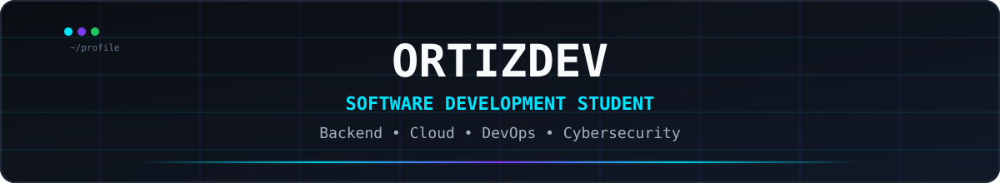

<p align="center">
  
</p>

<p align="center">
  
  
</p>

<p align="center">
  <b>5th-cycle Software Design and Development student at TECSUP</b><br>
  Lima, Peru 🇵🇪
</p>

---

## `> [System.Bio]`

- 🎓 **Education:** TECSUP · Software Design and Development · 5th Cycle
- ⚙️ **Focus:** Backend · Cloud · DevOps
- 🔐 **Security:** Secure Software Design · Authentication · Authorization
- 🧩 **Architecture:** REST APIs · Microservices · Distributed Systems
- ☁️ **Infrastructure:** Docker · CI/CD · AWS
- 🐧 **Environment:** Fedora Linux · macOS

---

## `> [Environment.Stack]`

<table>
<tr>

<td align="center" width="33%">

### Backend


<br>

`PHP` `Laravel` `Node.js` `Express`

</td>

<td align="center" width="33%">

### Frontend


<br>

`React` `JavaScript` `HTML` `CSS`

</td>

<td align="center" width="33%">

### Mobile


<br>

`Flutter` `Dart` `Swift`

</td>

</tr>

<tr>

<td align="center">

### Databases


<br>

`PostgreSQL` `MySQL` `MongoDB`

</td>

<td align="center">

### Cloud & DevOps


<br>

`Docker` `AWS` `CI/CD`

</td>

<td align="center">

### Tools


<br>

`Git` `GitHub` `Linux` `Bash` `macOS`

</td>

</tr>
</table>

---

## `> [Current.Focus]`

```text
Backend Engineering
├── REST API Design
├── Authentication & Authorization
├── Database Integration
├── MVC Architecture
└── Secure Application Design

Cloud & DevOps
├── Docker / Docker Compose
├── CI/CD Pipelines
├── Nginx
├── AWS
└── Deployment Architecture

Software Engineering
├── Microservices
├── Automated Testing
├── Software Architecture
└── Distributed Systems
```

---

## `> [Development.Scope]`

<table>
<tr>
<td>

### ⚙️ Backend

REST APIs  
Authentication  
Authorization  
Validation  
Email Services  
Notifications  

</td>

<td>

### ☁️ Infrastructure

Docker  
Nginx  
Redis  
CI/CD  
AWS  
Health Checks  

</td>
</tr>

<tr>
<td>

### 🗄️ Data

PostgreSQL  
MySQL  
MongoDB  
Prisma  
Mongoose  
ORM / ODM  

</td>

<td>

### 📱 Mobile

Flutter  
Dart  
Swift  
Responsive UI  
Navigation  
Testing  

</td>
</tr>
</table>

---

## `> [Collaboration]`

Worked on academic and collaborative projects involving:

`Web Applications` · `REST APIs` · `Microservices` · `IoT` · `Cloud` · `Mobile` · `Databases`

---

## `> [Private.Work]`

Some repositories and implementation details remain private because they are part of ongoing academic and professional work.

Current experience includes:

`B2B E-commerce` · `Backend Architecture` · `Admin Systems` · `Docker` · `CI/CD` · `Cloud Deployment` · `Software Security`

> One ongoing private project is also part of my academic thesis.

---

## `> [Current.Status]`

```bash
student@tecsup:~$ whoami
OrtizDev

student@tecsup:~$ cycle
5th

student@tecsup:~$ focus
Backend / Cloud / DevOps

student@tecsup:~$ status
Learning. Building. Testing. Improving.
```

---

<p align="center">
  
</p>

<p align="center">
  <b>Secure · Maintainable · Scalable · Testable · Deployable</b>
</p>

<p align="center">
  <sub>Software Development Student · TECSUP 🇵🇪</sub>
</p>
